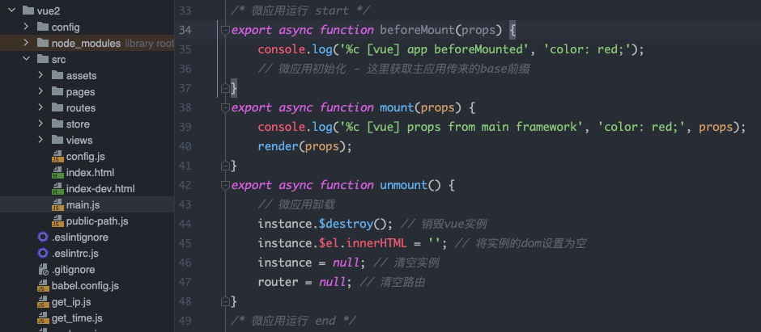

# niuer：
- Microfront-end framework 微前端框架

## 安装
- pnpm add niuer
- npm install niuer
- yarn add niuer

## 使用
1. 子系统开发方式
   - 在src下新建public-path.js
       ```js
           if (window.__POWERED_IS_NIUER__) {
              __webpack_public_path__ = window.__INJECTED_PUBLIC_PATH_IS_NIUER__;
          }
       ```
     

- main.js中引入` import './public-path'; `  
  
- 【建议】新建/修改routes，导出routes列表  
  
- 在main.js中引入routes并注册路由  
  
- 微应用时，需在main.js导出以下三个钩子
    1. beforeMount
        ```js
            export async function beforeMount() {
                console.log('app beforeMounted');
            }
        ```
    2. mount
        ```js
            export async function mount(props) {
                console.log('props from main framework', props);
                render(props);
            }
        ```
    3. unmount
        ```js
            export async function unmount() {
                instance.$destroy();
                instance.$el.innerHTML = '';
                instance = null;
                router = null;
            }
        ```  
  
- 子系统打包output新增配置(webpack5.x)
    ```js
        const { name } = require('package.json');
        output: {
            library: `${name}`,
            libraryTarget: 'umd',
            chunkLoadingGlobal: `webpackJsonp_${name}-[name]`
        }
    ```  
  
- 子系统打包output新增配置(webpack4.x)
    ```js
        const { name } = require('package.json');
        output: {
            library: `${name}`,
            libraryTarget: 'umd',
            chunkLoadingGlobal: `webpackJsonp_${name}-[name]`
        }
    ```  

- main.js整体配置参考
    ```js
        import './public-path';
        import Vue from 'vue';
        import VueRouter from 'vue-router';
        import routes from './routes';
        import App from './views/App';
        
        Vue.use(VueRouter);
        
        // NIUER注入的全局变量
        const isNE = window.__POWERED_IS_NIUER__;
        
        // 路由
        let instance = null, // vue实例
            router = null; // 路由
        
        // vue挂载函数
        const render = (props = {}) => {
            router = new VueRouter({
                mode: 'history',
                base: isNE ? `${props.prefix}` : '/',
                routes
            });
            const { container } = props;
            instance = new Vue({
                router,
                render: h => h(App)
            }).$mount(container ? container.querySelector('#app') : '#app');
        };
        // 独立运行
        if (!isNE) render();
        
        /* 微应用运行 start */
        export async function beforeMount() {
            // console.log('app beforeMounted');
        }
        export async function mount(props) {
            // console.log('props from main framework', props);
            render(props);
        }
        export async function unmount() {
            // 微应用卸载
            instance.$destroy(); // 销毁vue实例
            instance.$el.innerHTML = ''; // 将实例的dom设置为空
            instance = null; // 清空实例
            router = null; // 清空路由
        }
        /* 微应用运行 end */
    ```
2. 主应用与微应用通信
    - 引用
    ```js
        import { GlobalAction } from 'niuer';
        const globalAction = new GlobalAction({ loading: true })
    ```
   - 修改单个属性数据
   `globalAction.setItem('loading', false);`
   - 获取单个属性数据
   `globalAction.setItem('loading');`
   - 获取所有数据
   `globalAction.getState();`
   - 设置所有数据（这里会重新初始化 - 慎用）
   `globalAction.setState({ loading: true });`
   - 监听数据改变回调
   ```js
        globalAction.onStateChange((cur, prev) => {
            console.log('数据改变', cur, prev);
        });
   ```
3. 集成vite打包
      - 设置 `build.lib` ,这里参考vite官网
    
